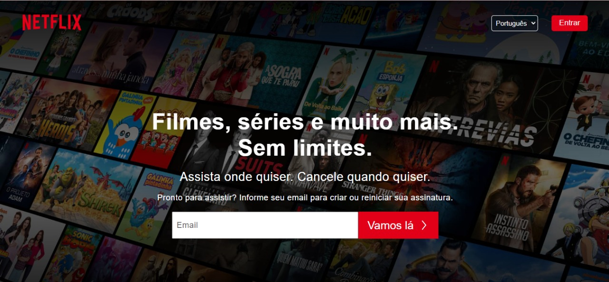
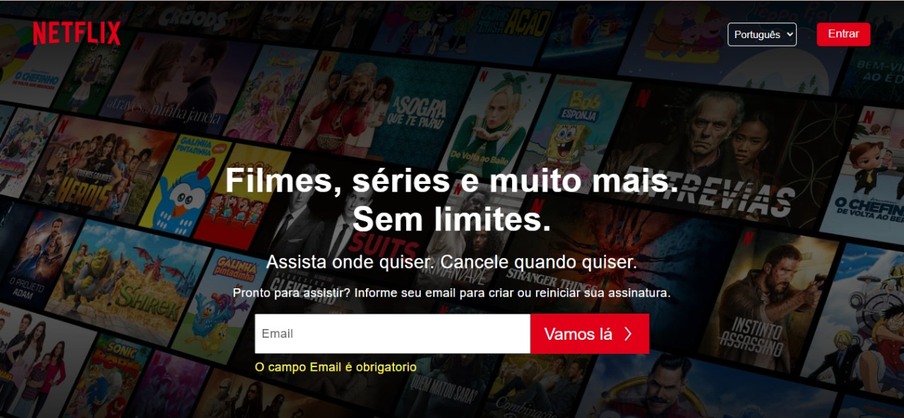
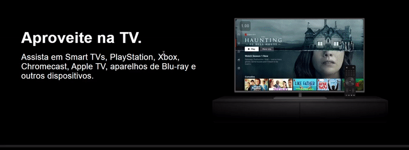
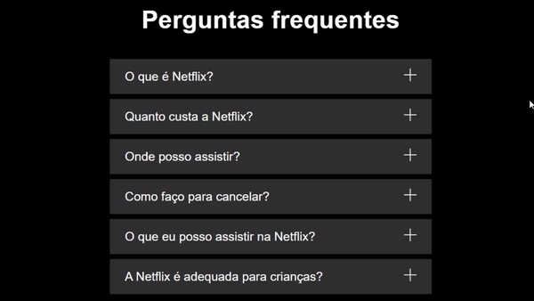

# Clones

### repositório criado para armazenamento de clones de sites
---

### :computer: desktop  :

### :vibration_mode:Design responsivo:

### :newspaper: Formulários validados no FrontEnd:

 

### :arrow_forward: Cards com videos dinâmicos:

### :grey_question: :question: Questionário Dinâmico:

