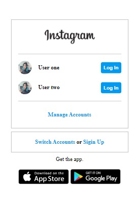

## Desafio  de HTML e CSS da plataforma [DIO](www.dio.me)

## Descrição do Desafio

Nesse projeto você terá o desafio de reconstruir a página de login do Instagram. Para isso, é recomendado o uso de CSS com Flexbox, uma das abordagens de posicionamento de elementos mais utilizadas quando se trata de responsividade.

### :desktop_computer: Desktop:

### 📱 mobile:

- Apesar do desafio pedir apenas CSS tomei liberdade de utilizar JS para fazer a animação das imagens.
- clique <a href="https://flaviogp.github.io/bootcamps/clone-instagram/" target="_blank">aqui</a> para acessar a página