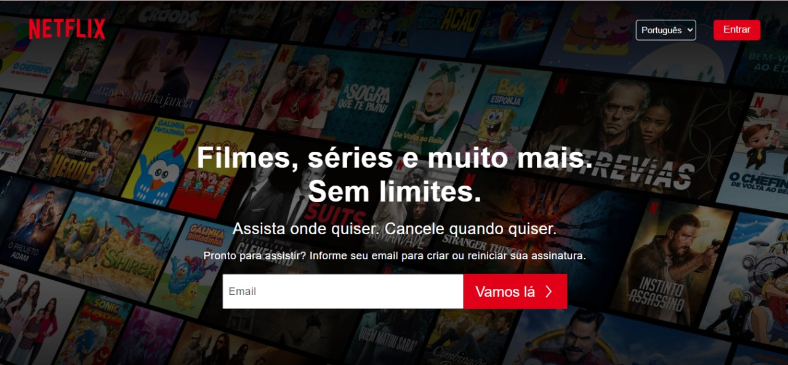
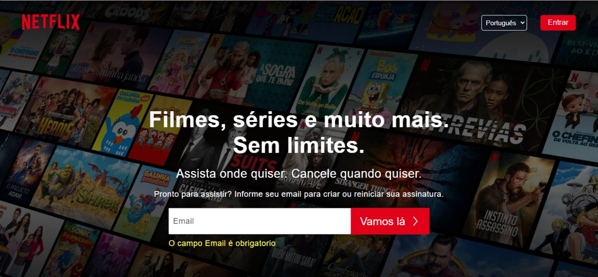
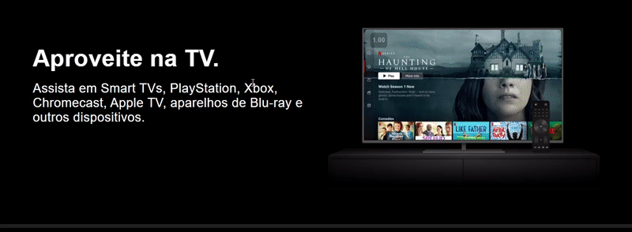
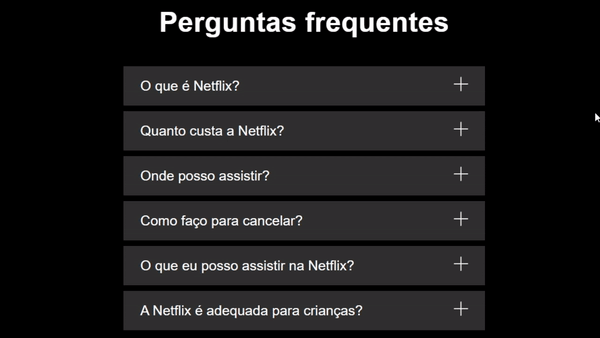

# Netflix

### :computer: desktop  :

### :vibration_mode:Design responsivo:

### :newspaper: Formulários validados no FrontEnd:

 

### :arrow_forward: Cards com videos dinâmicos:

### :grey_question: :question: Questionário Dinâmico:

- Para acessar a pagina clique [aqui](https://flaviogp.github.io/clones/netflix/)